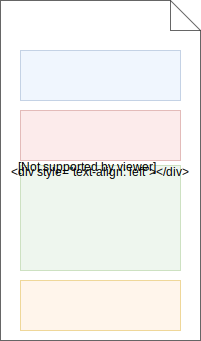
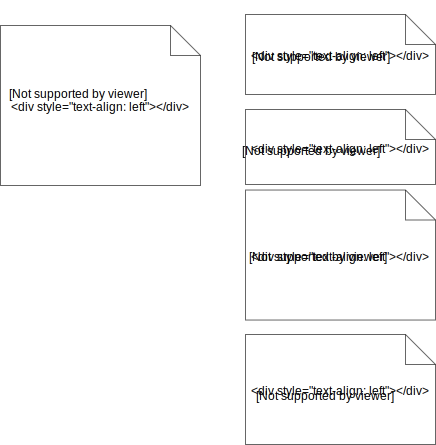

# Organising Infrastructure Code


### Organising Infrastructure Code

```console
$ cd $WORKDIR/sample-code/lesson1
$ tree
.
├── ansible
│   ├── block.yml
│   ├── group_vars
│   │   └── all.yml
│   ├── hosts
│   ├── long-playbook.yml
│   ├── project.yml
│   ├── secrets.yml
│   ├── templates
│   │   └── config.py.j2
│   └── touch-files.yml
├── ansible.cfg
└── touch-files.yml
```

>In all following examples, `$WORKDIR` is the path to the `sample-code` directory.


### Refactoring Infrastructure Code

* Projects often grow organically <!-- .element: class="fragment" data-fragment-index="0" -->
* Pressure to get things done quickly <!-- .element: class="fragment" data-fragment-index="1" -->
* Sources of technical debt <!-- .element: class="fragment" data-fragment-index="2" -->
    * Copy paste <!-- .element: class="fragment" data-fragment-index="2" -->
    * Code organisation <!-- .element: class="fragment" data-fragment-index="3" -->
* Eventually you will probably need to refactor <!-- .element: class="fragment" data-fragment-index="4" -->


### Refactoring a Playbook

* Ideal to break infrastructure code into smaller components <!-- .element: class="fragment" data-fragment-index="0" -->
  - Compartmentalise logic <!-- .element: class="fragment" data-fragment-index="1" -->
  - Avoid repetition <!-- .element: class="fragment" data-fragment-index="2" -->
  - Code reuse <!-- .element: class="fragment" data-fragment-index="3" -->
    * use in multiple parent playbooks
    * multiple times in same playbooks
* We can reuse<!-- .element: class="fragment" data-fragment-index="4" --> _tasks_ and _plays_ 


### Importing and including

* Two modes for reusing code in Ansible <!-- .element: class="fragment" data-fragment-index="0" -->
  - static <!-- .element: class="fragment" data-fragment-index="1" -->
  - dynamic <!-- .element: class="fragment" data-fragment-index="2" -->
* Static <!-- .element: class="fragment" data-fragment-index="3" -->
  - Processed during playbook parsing 
  - <!-- .element: class="fragment" data-fragment-index="4" -->begin with `import*` 
* Dynamic <!-- .element: class="fragment" data-fragment-index="5" -->
  - Processed at run time when the task/play is encountered
  - <!-- .element: class="fragment" data-fragment-index="6" -->begin with `include*` 


### Importing playbooks

#### `import_playbook`

  <div style="width:45%;float:left;">
  <pre class="fragment" data-fragment-index="0"><code data-trim>
  - name: First play
    hosts: somehosts
    tasks:
      - name: First task
      - name: Second task
  - name: Another play
    hosts: somehosts
    tasks:
      - name: Another task
      - name: Another task
  </code></pre>
  </div>
  <div style="width:55%;float:right;"  >
  <p style="font-size:16pt;" class="fragment" data-fragment-index="1">
  play1.yml
  </p>
  <pre class="fragment" data-fragment-index="1"><code data-trim>
  - name: First play
    hosts: somehosts
    tasks:
        - name: First task
        - name: Second task
  </code></pre>
  <pre class="fragment" data-fragment-index="2"><code data-trim data-noescape>
  <mark>- import_playbook: play1.yml</mark>
  - name: Another play
    hosts: somehosts
    tasks:
      - name: Another task
      - name: Another task
  </code></pre>
  </div>


### Tasks

* Useful to organise tasks into logical units
* Can be reused in multiple playbooks
* Can be reused multiple times in same playbook
  - Processing iterative blocks


### Refactoring tasks

 <!-- .element: width="20%"  style="float:left;" -->
 <!-- .element: width="40%" style="float:right;" class="fragment" data-fragment-index="0"-->


### Task files

* The<!-- .element: class="fragment" data-fragment-index="0" --> conventional approach is to break tasks out into separate _task files_ 
* A<!-- .element: class="fragment" data-fragment-index="1" --> _task file_ only contains a YAML list 
<pre class="fragment" data-fragment-index="1"><code class="json" data-trim>
    - name: This is task 1

    - name: This is task 2
    .
    .
    - name: This is task n
</code></pre>
* Ideally tasks related to specific purpose <!-- .element: class="fragment" data-fragment-index="2" -->
* Import them into your playbooks as needed <!-- .element: class="fragment" data-fragment-index="3" -->


### Project layout

Conventional organisation of tasks in ansible
 <pre><code class="console" data-trim data-noescape>
 $ mkdir -p $WORKDIR/lesson1/ansible/tasks
 .
 └── ansible
      ├── hosts
      ├── long-playbook.yml
<mark class="fragment" data-fragment-index="0">      └── tasks</mark>
<mark class="fragment" data-fragment-index="1">            ├── db.yml
            ├── monitoring.yml
            ├── server.yml
            └── setup.yml</mark>
 </code></pre>

* In general you can put task files anywhere as long they can be resolved by ansible <!-- .element: class="fragment" data-fragment-index="2" -->
* Having moved tasks out of playbook, you now need a way to incorporate them into the parent playbook <!-- .element: class="fragment" data-fragment-index="3" -->


### Including files in Ansible

#### `include`

 <!-- .element: class="fragment" data-fragment-index="0" -->


### Including _tasks_ in Ansible

#### `import_tasks`

Statically include a task list

<pre  class="fragment" data-fragment-index="0"><code data-trim data-noescape>
name: Main playbook
tasks:
  - debug:
      msg: Task in main playbook

  <mark>- import_tasks: tasks/import-stuff.yml</mark>

  - debug:
      msg: Second task in main playbook
</code></pre>

* Ansible parses the task file, including all tasks, at start when the <!-- .element: class="fragment" data-fragment-index="1" -->
  playbook is parsed


### Including _tasks_ in Ansible

#### `include_tasks`

Dynamically include a task list

<pre  class="fragment" data-fragment-index="0"><code data-trim data-noescape>
name: Main playbook
tasks:
  - debug:
      msg: Task in main playbook

  <mark>- include_tasks: tasks/import-stuff.yml</mark>
  <mark>- include_tasks: "tasks/{{ myfile  }}.yml"</mark>

  - debug:
      msg: Second task in main playbook

</code></pre>

* Ansible parses the task file when the <!-- .element: class="fragment" data-fragment-index="1" --> task is encountered during playbook execution


### Exercise: Refactor a playbook using task files

* Break up `long-playbook.yml` into separate tasks files
* The way you organise them is up to you
* Example:
  - basic setup
  - db setup
  - application setup
  - monitoring setup


### Refactoring our playbook

```yaml
  tasks:
    - debug:
        msg: Running main playbook task

    - import_tasks: tasks/basic.yml
    - import_tasks: tasks/db.yml
    - import_tasks: tasks/app.yml
    - import_tasks: tasks/monitoring.yml
    
```
Answers may vary <!-- .element: class="fragment" data-fragment-index="0" -->


### Refactoring our playbook

#### Alternative approach

* Use `include_tasks` to dynamically load files

```yaml
  tasks:
    - debug:
        msg: Running main playbook task

    - include_tasks: "tasks/{{ item }}.yml"
      with_items:
        - basic
        - db
        - app
        - monitoring
```
note: import_tasks will not work here because of how ansible parses playbooks <!-- .element: class="fragment" data-fragment-index="0" -->


### Passing variables to includes

* Importing tasks is useful when it is necessary to iterate over sets of tasks
* ..or when tasks need to be run in different contexts 
* Can be necessary to pass variables into included/imported tasks


### Passing variables to includes

* Pass a variable to an include using `vars:` attribute
* Variable scope only within the included task file

<pre  class="fragment" data-fragment-index="0"><code data-trim data-noescape>
 - import_tasks: tasks/some-tasks.yml
   vars:
     foo: "bar"
     bizz: "buzz"
</code></pre>


### Exercise: Refactor a playbook to use tasks

* Playbook `touch-files.yml` just creates a directory and touches a few files
* Refactor this to use tasks instead


### Exercise: pass variables to an included file

* Task file 
  - Use variables instead of fixed paths

<pre  class="fragment" data-fragment-index="0"><code data-trim>
$ mkdir -p tasks
$ $EDITOR tasks/files.yml
</code></pre>

<pre  class="fragment" data-fragment-index="1"><code data-trim data-noescape>
- name: Create directory for file
  file:
    path: "{{ path }}"
    state: directory

- name: touch file in directory
  file:
    path: "{{ path }}/{{ file }}"
    state: touch 
</code></pre>


### Exercise: pass variable to an included file

* Modify `touch-files.yml` to use `tasks/files.yml`
* Pass the path and file parameters in to tasks

<pre  class="fragment" data-fragment-index="0"><code data-trim data-noescape>
  tasks:
    
    - import_tasks: tasks/files.yml
      vars:
        path: /tmp/foo
        file: bar.txt

    - import_tasks: tasks/files.yml
      vars:
        path: /tmp/foo
        file: bizz.txt
</code></pre>


### Refactor main playbook to pass dictionary to include

* This works, but we import the same task multiple times for different files
* It is possible to use complex data in our tasks so we only have to import
  the task file once

<pre  class="fragment" data-fragment-index="0"><code data-trim>
- name: Create a directory and touch file
  import_tasks: tasks/files.yml
  vars:
    files:
      foo:
        path: /tmp/foo
      bar:
        path: /tmp/foo
</code></pre>


### Iterating over complex data

* Modify `files.yml` to process _files_ dictionary

```yaml
- name: Create directory
  file:
    path: "{{ item.value.path }}"
    state: directory
  with_dict:  "{{ files }}"

- name: touch file
  file:
    path: "{{ item.value.path }}/{{ item.key }}"
    state: touch
  with_dict:  "{{ files }}"

```


### Passing conditionals to included files

* Includes can also take a conditional "when" attribute <!-- .element: class="fragment" data-fragment-index="0" -->
    <pre  class="fragment" data-fragment-index="0"><code data-trim data-noescape>
   - import_tasks: some-stuff.yml
     <mark>when: true</mark>
    </code></pre>
* Conditional is not used to control import <!-- .element: class="fragment" data-fragment-index="1" -->
* Rather it is applied to each task in the imported file <!-- .element: class="fragment" data-fragment-index="2" -->


### Passing conditionals

* Let's add a conditional to import_tasks in `long-playbook.yml`

<pre  class="fragment" data-fragment-index="0"><code data-trim data-noescape>
    - import_tasks: tasks/basic.yml
      vars:
        some_list:
          - true
          - false
      when: item | bool <mark  class="fragment" data-fragment-index="1">&lt;-- condition gets passed to each task</mark>
</code></pre>
 


### Conditional behaviour on imported tasks

* Modify `tasks/basic.yml` to iterate over the `some_list` variable
* Run `long-playbook.yml` and note some tasks are skipped when `item == false`

```yaml
- name: Basic setup task
  debug:
    msg: Running 1st setup task
  with_items: "{{ some_list }}"

- name: Basic setup task 2
  debug:
    msg: Running 2nd setup task
  with_items: "{{ some_list }}"
```


### Blocks

* Blocks allow for logical grouping of tasks <!-- .element: class="fragment" data-fragment-index="0" -->
* Directives that can be applied to a single task can be applied to groups of
  <!-- .element: class="fragment" data-fragment-index="1" -->
  tasks in a block
  - when clauses
  - privilege escalation


### Using blocks

  <pre style="font-size:15pt;"><code data-trim data-noescape>
  become: false
  tasks:
    - debug:
        msg: Outside a block

    - name: Set up server
      block:
        - name: Install nginx
          apt:
            name: nginx
            state: present
      when:
       - ansible_distribution == "Ubuntu"
      become: true
  </code></pre>

* Run the playbook `block.yml`


### Summary

* Includes provide way to organise infrastructure for large projects
  - `import*` for static inclusion
  - `include*` for dynamic inclusion
* For tasks, include statements take a `vars` argument for passing variable data in scope
  of include
* Conditionals applied to task includes are actually applied to each task in an
  included file
