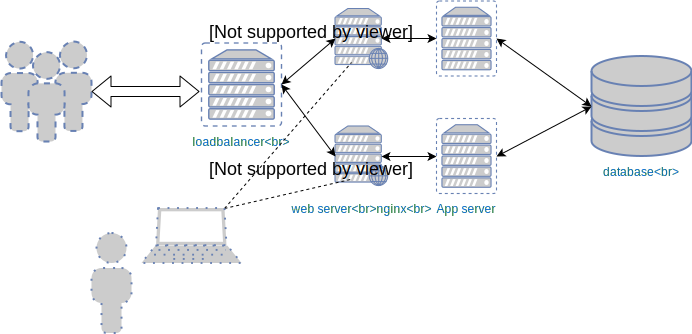
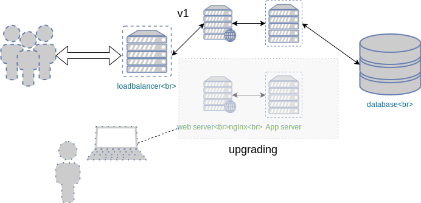

## Upgrade strategies

### _In place_ rolling upgrade


#### Rolling upgrades

<pre><code data-trim data-noescape>

$ cd $WORKDIR/upgrade-strategies
.
├── failhosts.yml
├── group_vars
.
├── inventory
.
├── remove-hosts.yml
.
├── update-app-in-place.yml
└── update-nginx-in-place.yml
</code></pre>


#### Simple application


<!-- .element width="80%" height="80%" -->


#### Upgrading our application

##### What can go wrong?

* Without some kind of redundancy, we risk of disrupting entire operation <!-- .element: class="fragment" data-fragment-index="0" -->
* Could be bad for business <!-- .element: class="fragment" data-fragment-index="1" -->

<div  class="fragment" data-fragment-index="0">


<!-- .element width="50%" height="50%"-->
</div>


#### Load balanced application

 <!-- .element width="50%" height="50%" -->

* Applications often installed on multiple machines/clusters
  - Ensures redundancy
  - High availability


#### Ansible default behaviour

* By default Ansible will act on multiple hosts at once <!-- .element: class="fragment" data-fragment-index="0" -->
* This can still lead to problems <!-- .element: class="fragment" data-fragment-index="1" -->

 <!--
.element: style="float:left;" width="45%" height="45%" class="fragment" data-fragment-index="0"-->
 <!--
.element: style="float:right;" width="45%" height="45%"  class="fragment" data-fragment-index="1" -->


#### In-place rolling upgrade

* Traditional approach to upgrading applications across a cluster <!-- .element: class="fragment" data-fragment-index="0" -->
  - Creating new infrastructure can be prohibitively expensive
* Operates on infrastructure that already exists <!-- .element: class="fragment" data-fragment-index="1" -->
* Minimise downtime by upgrading parts of the cluster at a time <!-- .element: class="fragment" data-fragment-index="2" -->


#### Performing `serial` operations

* The<!-- .element: class="fragment" data-fragment-index="0" --> `serial` attribute regulates how many hosts Ansible operates on at a time 
* Serial can be represented as <!-- .element: class="fragment" data-fragment-index="1" -->
  * An integer <!-- .element: class="fragment" data-fragment-index="2" -->
   <pre  class="fragment" data-fragment-index="3" style="font-size:15pt;"><code data-trim data-noescape>
    - name: Upgrade application in place
      become: true
      hosts: app
      <mark>serial: 1</mark>
      vars:
    </code></pre>
  * A percentage of hosts in the cluster to act on <!-- .element: class="fragment" data-fragment-index="4" -->
    <pre  class="fragment" data-fragment-index="5" style="font-size:15pt;"><code data-trim data-noescape>
    - name: Upgrade application in place
      become: true
      hosts: app
      <mark>serial: "30%"</mark>
      vars:
    </code></pre>


#### First step of in place upgrade

 <!-- .element
width="50%" height="50%"-->

* Disable application at LB (no HTTP requests) <!-- .element: class="fragment" data-fragment-index="0" -->
* Upgrade necessary applications, configuration <!-- .element: class="fragment" data-fragment-index="1" -->
* Re-enable at LB <!-- .element: class="fragment" data-fragment-index="2" -->


#### In place rolling upgrade
 <!-- .element width="50%" height="50%"-->

* Repeat process across pool <!-- .element: class="fragment" data-fragment-index="0" -->
* Mixed versions will be running for a period of time <!-- .element: class="fragment" data-fragment-index="1" -->


#### Delegation

* The application that we need to update is on our app servers <!-- .element: class="fragment" data-fragment-index="0" -->
* However, as part of updating, we need to control haproxy on our loadbalancer
  <!-- .element: class="fragment" data-fragment-index="1" -->
* Key to this is the<!-- .element: class="fragment" data-fragment-index="2" --> `delegate_to` task attribute 

<pre class="fragment" data-fragment-index="2"><code data-trim data-noescape>
- name: Upgrade application in place
  <mark>hosts: app</mark>
  serial: 1
  tasks:
    - name: Disable application at load balancer
      haproxy:
        .
        .
      <mark>delegate_to: "loadbalancer"</mark>
</code></pre>


#### Ensuring healthy upgrade

* After upgrading the application or config, typically want to <!-- .element: class="fragment" data-fragment-index="0" -->
  - Restart service that was upgraded <!-- .element: class="fragment" data-fragment-index="1" -->
  - Re-enable at loadbalancer <!-- .element: class="fragment" data-fragment-index="2" -->
* Before proceeding important to <!-- .element: class="fragment" data-fragment-index="3" -->
  - Reload or restart our service <!-- .element: class="fragment" data-fragment-index="4" -->
  - Make sure service is<!-- .element: class="fragment" data-fragment-index="5" --> _healthy_ 


#### Ensuring healthy upgrade

* When we upgrade our application or config we trigger a restart using<!-- .element: class="fragment" data-fragment-index="0" --> _notify_ 

  <pre  class="fragment" data-fragment-index="0"><code data-trim data-noescape>
  - name: Checkout application from git
    git:
      .
      .
    <mark>notify: restart gunicorn</mark>
  </code></pre>
* Normally this would trigger the handler at the end of a play <!-- .element: class="fragment" data-fragment-index="1" -->
  <pre  class="fragment" data-fragment-index="1"><code data-trim data-noescape>
  handlers:
    - name: restart gunicorn
      systemd:
        name: gunicorn
        state: restarted
  </code></pre>


#### Waiting for a service

* Instead of waiting for handler to execute at the end of play, we trigger it
  immediately<!-- .element: class="fragment" data-fragment-index="0" -->

  <pre  class="fragment" data-fragment-index="0"><code data-trim data-noescape>
  - name: Checkout application from git
    git:
      .
    notify: restart gunicorn
  <mark>- meta: flush_handlers</mark>
  </code></pre>
* We proceed when we are sure that the service is running <!-- .element: class="fragment" data-fragment-index="1" -->
  <pre  class="fragment" data-fragment-index="1"><code data-trim data-noescape>
    - name: Make sure app is listening on port 500
      wait_for:
        port: 5000
  </code></pre>


#### Failing fast

* When upgrading an application, it's important to stop if there are problems
* Normally, if an error occurs on a particular host, Ansible will
  - Drop that host from the list of play hosts
  - Proceed to process the play on all other hosts
* This presents a problem as we may progressively crash all other hosts on same error


#### Failing fast

* Have a look at `failhosts.yml` and `inventory/failhosts`
* Run the playbook:
  ```
  $ ansible-playbook -i ansible/inventory/failhosts \
      ansible/failhosts.yml --ask-vault-pass
  ```
* The first task fails for `failhost10`
* Play proceeeds to run for `failhost0` thru `failhost9`


#### Stopping on any error

##### `any_errors_fatal`

* Tells Ansible to consider operation a failure if an error occurs on one host
  <!-- .element: class="fragment" data-fragment-index="0" -->
  <pre  class="fragment" data-fragment-index="1"><code data-trim data-noescape>
  - name: Any errors fatal example
    hosts: failhosts
    gather_facts: false
    <mark>any_errors_fatal: true</mark>
    tasks:
  </code></pre>
* Now <!-- .element: class="fragment" data-fragment-index="2" -->if the first task fails for `failhost10`, the entire play will be aborted at the first task


#### Failing based on proportion

##### `max_fail_percentage`

* Defines a percentage of hosts that can fail before operation is aborted <!-- .element: class="fragment" data-fragment-index="0" -->
  <pre  class="fragment" data-fragment-index="1"><code data-trim data-noescape>
  - name: Max fail percentage
    hosts: failhosts
    gather_facts: false
    <mark>max_fail_percentage: 20</mark>
    tasks:
  </code></pre>
* With previous example, playbook finishes because 10% &lt; 20% <!-- .element: class="fragment" data-fragment-index="2" -->


#### Upgrade our application

```
$ ansible-playbook  -K --ask-vault-pass \
   -i ansible/inventory \
   ansible/update-app-in-place.yml -e app_version=v2
```

* Should run an in-place upgrade to _v2_ of our app
* Changes the background colour of the application


#### Summary

* The _in place rolling upgrade_ is a common approach to updating applications
  - Ensures zero downtime
  - Doesn't require expensive infrastructure
* Leveraging how Ansible works is critical
* Process segements of cluster in serial
* Delegation to operate across cluster more easily
* Fail fast to avoid leaving cluster in broken state
